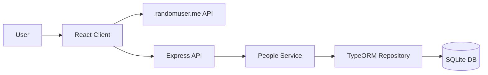

# Architecture

The application is split into two projects:

```text
client/  React + TypeScript + Vite
server/  Node + Express + TypeScript
```

The client fetches random profiles from `randomuser.me` and communicates with the backend only for saved profiles. The backend exposes a minimal REST API and persists saved profiles in SQLite through TypeORM.

## High-Level Flow



## Client Responsibilities

- Route between home, random list, saved list, and profile screens.
- Fetch 10 random users from `randomuser.me`.
- Manage random and saved profile state with Redux Toolkit.
- Render list filters and profile details.
- Save, update, and delete profiles through the backend API.

## Server Responsibilities

- Validate incoming profile payloads with Zod.
- Expose only the API endpoints required by the assignment.
- Keep route handlers thin.
- Keep persistence behind a repository layer.
- Store saved profiles in SQLite through TypeORM.

## Backend Layers

```text
routes/      HTTP concerns
services/    application behavior
db/          TypeORM data source, entity, repository
validation/  request validation schemas
types/       domain types
```

This keeps the API easy to extend without mixing HTTP, validation, and persistence logic in the same file.
